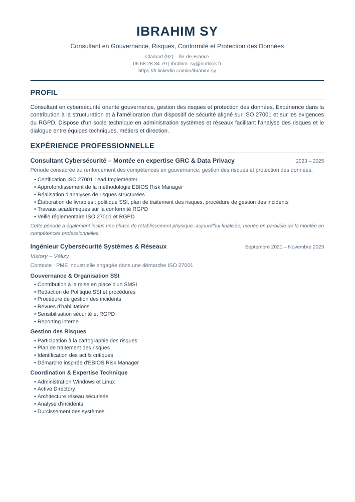
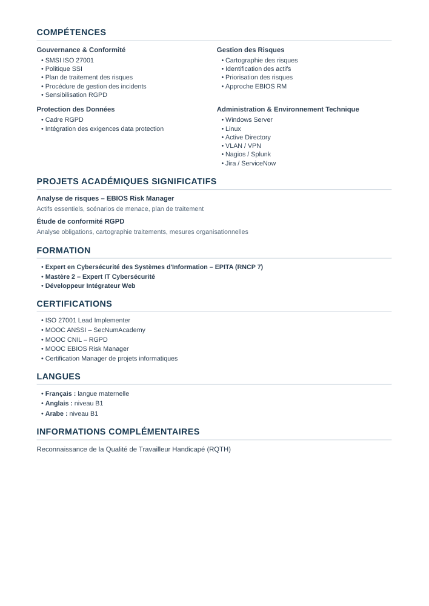

# Générateur de CV Professionnel - Ibrahim Sy

Ce projet génère un CV professionnel en format PDF pour un consultant en cybersécurité.

## 📄 CV Prêt à Télécharger

**Le CV est déjà généré et disponible dans ce repository !**

👉 **[Télécharger CV_Ibrahim_Sy.pdf](./CV_Ibrahim_Sy.pdf)** 👈

- **Fichier** : `CV_Ibrahim_Sy.pdf`
- **Taille** : 22 KB
- **Format** : PDF, 2 pages (A4)
- **Statut** : ✅ Prêt à envoyer aux recruteurs

### Aperçu du CV

<details>
<summary>📋 Cliquez pour voir l'aperçu des pages</summary>

**Page 1 :**


**Page 2 :**


</details>

## Caractéristiques

- **Design sobre et moderne** : Adapté aux cabinets de conseil en cybersécurité
- **Palette de couleurs professionnelle** : Dominante bleu foncé, gris et noir
- **Structure claire** : Hiérarchie visuelle bien définie
- **Format optimisé** : 2 pages (A4)
- **Police professionnelle** : Helvetica/Arial pour une lecture optimale
- **Prêt à l'emploi** : Format PDF directement envoyable aux recruteurs

## Prérequis

- Python 3.7 ou supérieur
- pip (gestionnaire de paquets Python)

## Installation

1. Cloner le dépôt :
```bash
git clone https://github.com/Ibrahimclm/projetGit.git
cd projetGit
```

2. Installer les dépendances :
```bash
pip install -r requirements.txt
```

## Utilisation

### Option 1 : Télécharger le CV déjà généré (Recommandé)

Le CV est **déjà disponible** dans ce repository : **[CV_Ibrahim_Sy.pdf](./CV_Ibrahim_Sy.pdf)**

Vous pouvez :
- Le télécharger directement depuis GitHub
- Le cloner avec le repository
- Cliquer sur le fichier dans l'interface GitHub et cliquer "Download"

### Option 2 : Regénérer le CV (Optionnel)

Si vous souhaitez modifier et regénérer le CV :

```bash
python generate_cv.py
```

Le fichier `CV_Ibrahim_Sy.pdf` sera recréé dans le répertoire courant.

## Structure du CV

Le CV comprend les sections suivantes :
- **En-tête** : Informations de contact
- **Profil** : Présentation professionnelle
- **Expérience professionnelle** : Parcours détaillé
- **Compétences** : Gouvernance, GRC, Protection des données, Technique
- **Projets académiques** : Projets significatifs
- **Formation** : Diplômes et formations
- **Certifications** : ISO 27001, ANSSI, CNIL, EBIOS RM
- **Langues** : Français, Anglais, Arabe
- **Informations complémentaires** : RQTH

## Personnalisation

Pour personnaliser le CV, modifiez les fonctions suivantes dans `generate_cv.py` :
- `get_cv_html()` : Pour modifier le contenu
- `get_cv_css()` : Pour ajuster le style et les couleurs

## Technologies utilisées

- **Python 3** : Langage de programmation
- **WeasyPrint** : Conversion HTML/CSS vers PDF
- **HTML5/CSS3** : Structure et mise en forme

## License

Ce projet est destiné à un usage personnel.
